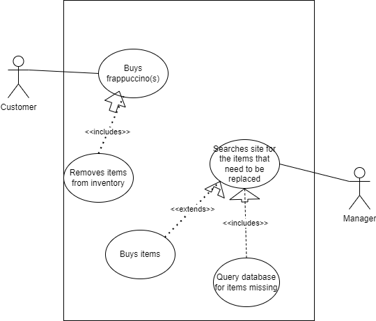
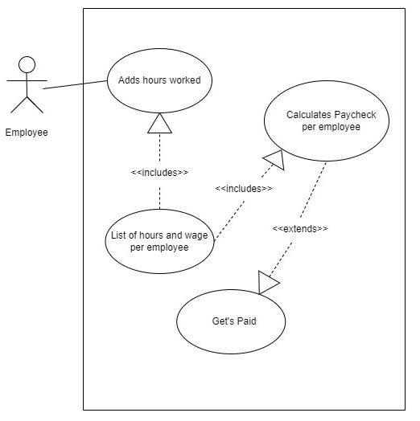
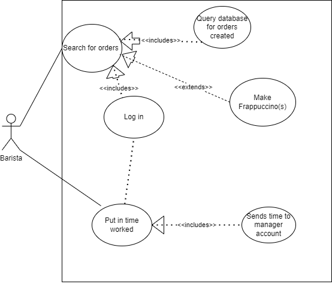
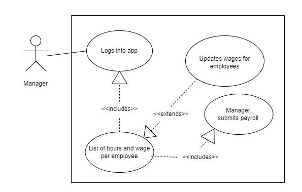
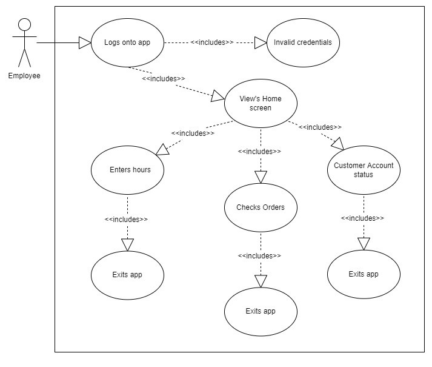
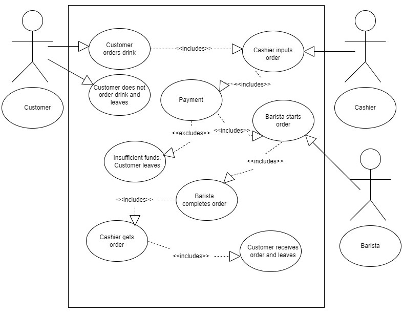
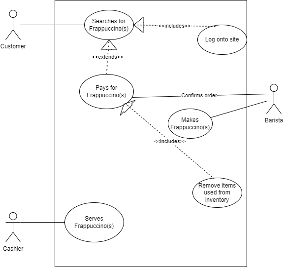
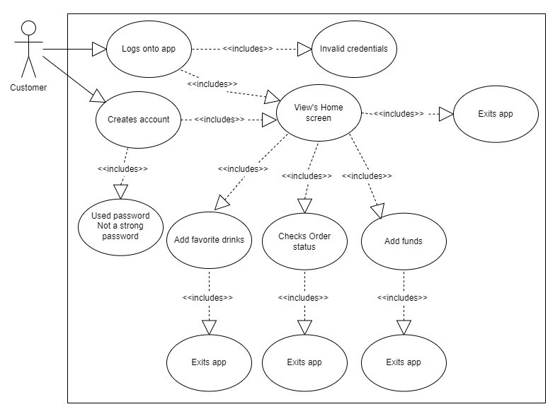
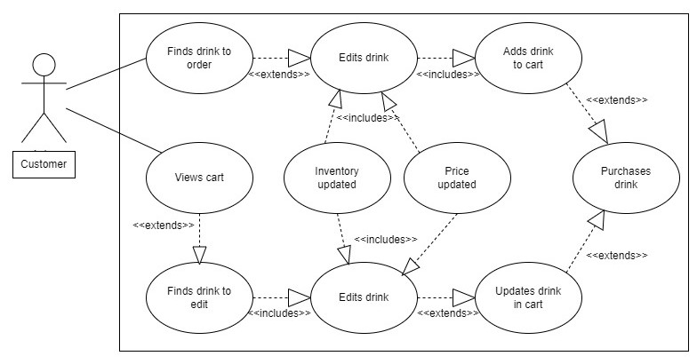

# Dan’s Frappes and Raps

## Introduction and Context

	With the growing popularity of Frappuccinos, lines grow long, low customer service, and employees getting overwhelmed. To help customers and employees with their coffee experience, this project aims to build an app which allows users to effectively buy from and run Dan’s Fraps and Raps.
	This app will allow customers to view a list of drinks, customize their drink, add a list of favorite drinks, create and add money to their account. It will give access for cashiers to take money from the customers and take walk-up orders. It will also keep track of an inventory of items in stock as the barista’s completes orders.
	The app will allow the Manager of Dan’s Fraps and Raps to purchase items to restock using money made from frap sales. It will also allow the manager to create or delete accounts and add new drinks to the menu. 
	By including a simple list of options for each user, the app will help Dan’s Fraps and Raps run smoothly, always keep items in stock and deliver fraps in a crack.

## Users and their Goals (Use case diagrams)

	*Figure 1. Customer uses app to buy a Frappuccino*

	Participating actors: Customer, Cashier, Barista
	Entry conditions:
		Customer enters app and looks at menu
	Exit conditions:
		Cashier serves frappuccino
		Customer can’t buy Frappuccino
		No inventory
		Customer is not a part of the club
	Event flow:
		1. Customer opens the app
		2. Customer logs in and searches for Frappuccino
		3. Customer pays for the frappuccino they choose
			a. Inventory for order gets reserved/removed
		4. Barista confirms the order
		5. Barista makes Frappuccino
		6. Cashier serves Frappuccino
		7. Customer leaves

	*Figure 2. Inventory for store*

	
	Participating actors: Customer, Manager
	Entry conditions:
		Customer buys Frappuccino which removes items from inventory
		Manager logs into their account
	Exit conditions:
		Manager closes app
		No items need replaced
		Manager finishes replacing inventory
	Event flow:
		1. Customer buys frappuccino
			b. App keeps track of what is removed and removes it
		2. Manager searches site for what is missing in the inventory
			a. App checks the database to see what items were removed
		3. Manager replaces inventory or buys new items to fill the inventory if needed
		4. Manager exits the app.

	*Figure 3. Employee getting paid*

	
	Participating actors: Employee
	Entry conditions:
		Employee logs in and enters hours worked
	Exit conditions:
		Employee gets paid
	Event flow:
		1. Employee enters hours worked
			a. App add hours to total of hours worked for each employee
			b. App calculates (hours * wage) for each employee
		2. Employee gets paid

	*Figure 4. Manager doing payroll*

	
	Participating actors: Manager
	Entry conditions:
		Manager logs on app
	Exit conditions:
		Manager pays employees
		Employees do not need to be paid yet
	Event flow:
		1. Manager updates wages for employees
		2. Manager views hours
			a. Verify wage and hours worked are correct
		3. Manager submits payroll
		4. Manager logs off app

	*Figure 5. Barista use case*

	
	Participating Actors: Barista
	Entry conditions:
		Barista looks for orders from customers
		Barista finishes shift and wants to put in hours
	Exit conditions:
		Barista finishes making the Frappuccino(s)
		Barista finishes putting in hours
	Event flow:
		1. Barista logs onto app
		2. Barista searches for orders they can make
		3. If there are orders then tha Barista makes the Frappuccino(s)
		4. Barista puts in the hours they worked
		5. Barista logs out of the app.

	*Figure 6. Walk-in Order*

	
	Participating Actors: Barista, Cashier, Customer
	Entry conditions:
		Customer orders a drink
		Cashier inputs order
		Barista receives order
	Exit conditions:
		Barista finishes making the Frappuccino(s)
		Cashier gives customer drink
		Customer receives drink
		Customer leaves without purchasing drink
	Event flow:
		1. Customer orders drink
			a. Customer does not order drink and leaves
		2. Cashier inputs order
		3. Payment
			a. Money out of customer’s funds
			b. Money into store sales
			c. Customer has insufficient funds and cannot purchase drink
		4. Barista receives order
			a. Makes orders
			b. Items taken out of stock
			c. Order is complete
		5. Order given to Cashier
		6. Cashier gives order to Customer
		7. Customer leaves

	*Figure 7. Employee Profiles*

	
	Participating Actors: Employee
	Entry conditions:
		Employee logs into app
	Exit conditions:
		Employee logs off app
	Event flow:
		1. Employee logs onto app
			a. Invalid Credentials - No login
			b. Valid Credentials - logs on
		2. Employee views home screen
			a. Employee can enter hours worked
			b. Employee can check orders
			c. Employee can view customers account status
		3. Employee logs off app

	*Figure 8. Customer Profile*

	
	Participating Actors: Customer
	Entry conditions:
		New customer wishes to create account
		Customer logs into account
	Exit conditions:
		Account created
		Favorite drink added to profile
		Funds added to account
	Event flow:
		1. Signs up for account
			a. Email is already in use - new account denied
			b. Password complexity is not sufficient - new account denied
			c. New account created
		2. Specify favorite drink
		3. Add Funds to account
			a. Payment Method denied - No funds added
			b. Funds added

	*Figure 9. Customer Edits Order*

	Participating Actors: Customer
	Entry conditions:
		Customer chooses drink from menu
		Customer views cart
	Exit conditions: 
		Customer purchases drink
	Event flow:
		1. Customer picks drink from menu
		2. Customer views cart
		3. Customer edits drink
			a. Inventory is updated
			b. Price of drink is updated
		4. Drink is updated in cart
		5. Drink is purchased

## Functional Requirements

	1. User Authentication and Access
		1.1. The app requires all users to authenticate themselves before gaining access to the feature.
			1.1.1. If the user does not have an account, they can choose to exit the app or create an account using email and password.
			1.1.2. Returning users must enter their email and password each time they open the app. If entered correctly, the user is given access to the other app features. If entered incorrectly, the user is prompted to try again.
		1.2. Users can have exclusively one of the following access rights: Manager, Cashier, Barista, Customer
			1.2.1. Users with Manager rights have access to all features.
			1.2.2. Users with Cashier rights have access to all Cashier features.
			1.2.3. Users with Barista rights have access to all Barista features.
			1.2.4. Users with Customer rights have access to all Customer features.
	2. User Profile Features
		2.1. The system will allow any authenticated user to modify their own password.
		2.2. The system will allow any authenticated user to modify their own email address.
		2.3. The system will allow any authenticated user to increase their account balance.
		2.4. The system will allow any authenticated user to view their account balance.
			2.4.1. No real money is required, users can add as much as they want through button clicks.
		2.5. The system should not allow any user that does not have Manager rights to view or modify any other profile.
		2.6. The system should allow all users except for Customers to withdraw money from their account.
	3. Customer Features
		3.1. Customer rights are exclusive and different from Manager, Cashier, and Barista rights.
			3.1.1. The business assumption is that employee accounts will be registered on their company email.
		3.2. Customer accounts must only be on a personal email.
		3.3. The system will allow those with Manager and Customer rights to access the Customer features.
		3.4. The system will allow Customers to save favorite drinks, adjust their account, browse the menu, and make online purchases with customizations.
			3.4.1. The system will allow Customers to select an item from the menu. When the customer selects an item. They will be displayed a card that allows them to pick size, adjust ingredients, and add to cart.
				3.4.1.1. The cart screen will display the added, customized item, as well as its price. 
				3.4.1.2. If the customer proceeds to checkout, the cost of the item will be deducted from their account. If they have insufficient funds, they will be unable to complete the purchase.
			3.4.2. After an order is placed, the customer can see their order status as it progresses.
	4. Manager features
		4.1. Only users with Manager rights should have access to manager features.
		4.2. Users with Manager rights can adjust, create, delete, or change data for all other users.
		4.3. The manager can view the employees hours, and select to pay them accordingly. 
			4.3.1. If a manager chooses to pay an employee based on their hours, their hours are reset to 0.
			4.3.2. The money will transfer from the manager's account to the employee’s account. 
		4.4. Managers can adjust the inventory of items, as well as add or remove items to the menu.
		4.5. Managers can do all other tasks associated with other features.
	5. Barista features
		5.1. Only users with Manager and Barista rights should have access to barista features.
		5.2. Baristas will receive the order with each item individually listed.
			5.2.1. As the barista makes the order, they will check off each individual item in the order. Upon being checked, the item is removed from inventory.
		5.3. The barista marks the drinks as made once all items have been checked.
		5.4. The barista gives the customer the order, and marks it as completed.
	6. Cashier features
		6.1. Only users with Manager and Cashier rights should have access to cashier features.
		6.2. Cashiers create orders for in-person customers.
			6.2.1.When a customer arrives to create an order, the cashier asks for their email, and looks up the account.
				6.2.1.1. If the account exists, the cashier selects it and proceeds with the order.
				6.2.1.2. If the account does not exist, the cashier instructs the customer to download the app and create an account.
			6.2.2. The cashier selects the items that the customer would like to order, accommodating any customizations.
			6.2.3. After all items the customer requests are placed into the cart, the cashier proceeds to checkout.
				6.2.3.1. If the customer has appropriate money in their account to cover the cost, the checkout completes and the money is moved to the manager account.
				6.2.3.2. If the customer does not have sufficient balance, the cashier is prompted to add balance, and will ask the customer how much to add.

## Non-Functional Requirements
	4.1 The system must use a database
		4.1.1 The system’s database must store user account information, including the following fields: Username, Password, Email Address, Account Balance
		4.1.2 The system must store information about the current inventory of products used to create frappuccinos
		4.1.2 The database must be scalable to support a large quantity of users
	4.2 The team will use the Git version control system, with GitHub as a remote repository.
	4.3 The system must be deployable
		4.3.1 The system will target Android 12 (API 33)
		4.3.2 The system will support a minimum API 28
	4.4 The system will be operable over the system’s entire lifecycle
		4.4.1 The system will be consistently maintained
	4.5 The system will comply the material3 design requirements here
	4.6 The system as a whole will satisfy all the requirements for assignments in CS3450 at Utah State University

## Future Features

This section contains a list of features that are beyond the scope of the project, but could be implemented in future versions.

	5.1 The system could add a non-functional requirement for legal compliance
	5.2 The system could add an automatic ordering system for daily customers
	5.3 The system could support iOS
	5.4 The system could create a web app for non-mobile users
	5.5 The system could support additional security/authentication features
		5.5.1 2FA
		5.5.2 Security Questions
		5.5.3 Account Recovery/Password reset
		5.5.4 Email confirmation
	5.6 The system could have a way for a user to attach their credit card to actually pay for some coffee or their employees.
	5.7 The system could add a way to add food as well as frappuccinos
	5.8 The system could allow the ability to adjust inventory for incorrect drinks made, spilled drinks, or customer wishes drink to be remade.

## Glossary

	Customer - a user that uses the system to deposit money and purchase Frappacinos from Dan’s Frappes and Raps
	Barista - a user that uses the system to submit their time clock and manage and create incoming orders from customers from the system
	Cashiers - a user that uses the system to submit their time clock and manage and create orders from customers that come to the store to order
	Manager -  a user that uses the system to check and buy inventory, pay employees and manage money collected from the Cashiers as well as managing and creating incoming orders or walk in customers
	System - refers to the mobile Android application that the project aims to build
	Employee - refers to three types of users (Baristas, Cashiers, and Managers) and is used to describe their shared functions in the system.
	User - refers to any of the four types of users of the system (Customers, Baristas, Cashiers, Managers)
